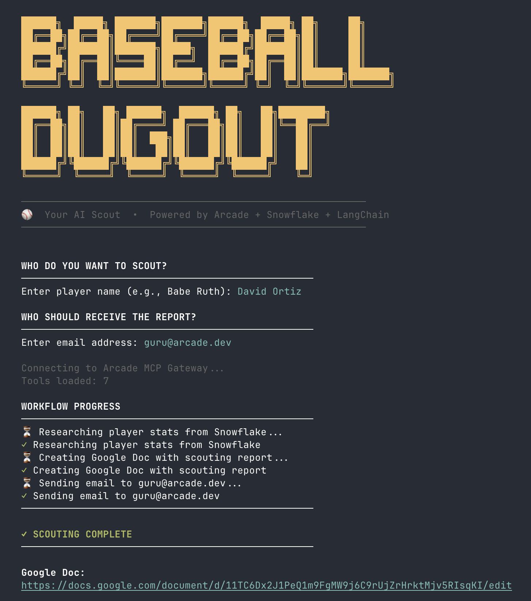

# ⚾ Baseball Dugout

**Give your coaching staff an AI-powered scout that researches players, generates reports, and shares them via email—all from a single conversation.**

## The Use Case

A coach needs to evaluate a player before a trade deadline. Instead of digging through spreadsheets, querying databases, and manually formatting reports:

1. **Ask the agent:** "Research David Ortiz"
2. **The agent:** Pulls career stats from Snowflake, creates a scouting report in Google Docs, and emails it to the coaching staff

The same pattern extends to any workflow: analyzing team schedules via Google Calendar, comparing players before draft picks, generating weekly performance summaries—AI agents that integrate with your existing tools.



## How It Works

This project demonstrates building **custom MCP tools** with [Arcade](https://arcade.dev) to securely connect AI agents to your data and productivity apps:

- **Snowflake** — Your data warehouse (player stats, team records)
- **Arcade** — Securely deploys tools + handles auth for Google Docs, Gmail, Calendar
- **LangChain** — Orchestrates the agent

```
┌──────────────────┐      ┌──────────────────┐      ┌──────────────────┐
│   LangChain      │ ───▶ │  Arcade MCP      │ ───▶ │   Snowflake      │
│   Agent          │      │  Gateway         │      │   Google Docs    │
└──────────────────┘      └──────────────────┘      │   Gmail          │
                                                    └──────────────────┘
```

**Why Arcade?** Your Snowflake credentials stay as secrets—never exposed to the LLM. Google OAuth happens just-in-time when needed. The agent calls tools like `GetPlayerStats("Babe Ruth")` instead of writing SQL.

## Quick Start

### 1. Set Up Snowflake

Create a free Snowflake account at [snowflake.com](https://signup.snowflake.com/).

**Download the dataset:** [Baseball Databank](https://www.kaggle.com/datasets/open-source-sports/baseball-databank) from Kaggle.

**Run SQL scripts in order** (in Snowsight web UI):

```
snowflake/
├── 01_setup_database.sql   # Create database, warehouse, schema
├── 02_create_tables.sql    # Create all baseball tables
├── 03_create_stage.sql     # Create stage for CSV upload
└── 04_load_data.sql        # Load CSV data into tables
```

**Upload CSV files** (between scripts 03 and 04):
1. Go to: Data → Databases → BASEBALL_ANALYTICS → PLAYER_DATA → Stages → BASEBALL_DATA_STAGE
2. Click "+ Files" → Upload: Master.csv, Batting.csv, Pitching.csv, Teams.csv, HallOfFame.csv, AllstarFull.csv, Salaries.csv, TeamsFranchises.csv

### 2. Deploy MCP Tools to Arcade

```bash
cd mcp

# Install Arcade CLI
pip install arcade-ai

# Login to Arcade
arcade login

# Set Snowflake credentials as secrets
arcade secrets set SNOWFLAKE_ACCOUNT your-account-id
arcade secrets set SNOWFLAKE_USER your_username
arcade secrets set SNOWFLAKE_PASSWORD your_password

# Deploy the MCP server
arcade deploy -e server.py
```
This can also be configured using Arcade Web UI

After deployment, create an MCP gateway in Arcade Dashboard and note the URL.

### 3. Run the Agent

```bash
cd agent

# Create virtual environment
python3 -m venv venv
source venv/bin/activate

# Install dependencies
pip install -r requirements.txt

# Configure environment
cp ../env.example ../.env
# Edit .env with your credentials

# Run
python baseball_agent.py
```

The agent will prompt you for:
1. Player name to research
2. Email address to send the report to

It will then create a Google Doc with the scouting report and email it.

## MCP Tools

| Tool | Description |
|------|-------------|
| `GetPlayerStats` | Career batting/pitching stats for a player |
| `GetTeamStats` | Team history and records |
| `ComparePlayers` | Head-to-head player comparison |
| `GetSeasonLeaders` | League leaders for a stat/year |
| `ExecuteBaseballQuery` | Custom SQL queries |

## Project Structure

```
baseball-dugout/
├── snowflake/             # SQL setup scripts
│   ├── 01_setup_database.sql
│   ├── 02_create_tables.sql
│   ├── 03_create_stage.sql
│   └── 04_load_data.sql
├── mcp/                   # MCP tools (deploy to Arcade)
│   ├── server.py
│   └── pyproject.toml
├── agent/                 # LangChain agent
│   ├── baseball_agent.py
│   └── requirements.txt
├── env.example
└── README.md
```

## Data

Baseball dataset: [Baseball Databank](https://www.kaggle.com/datasets/open-source-sports/baseball-databank) (Public Domain)

## License

MIT
